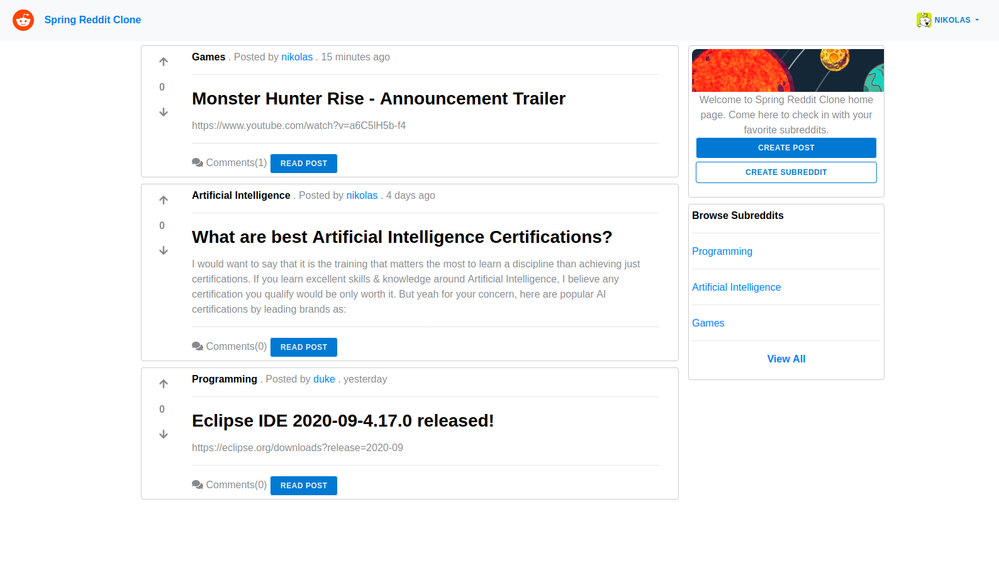
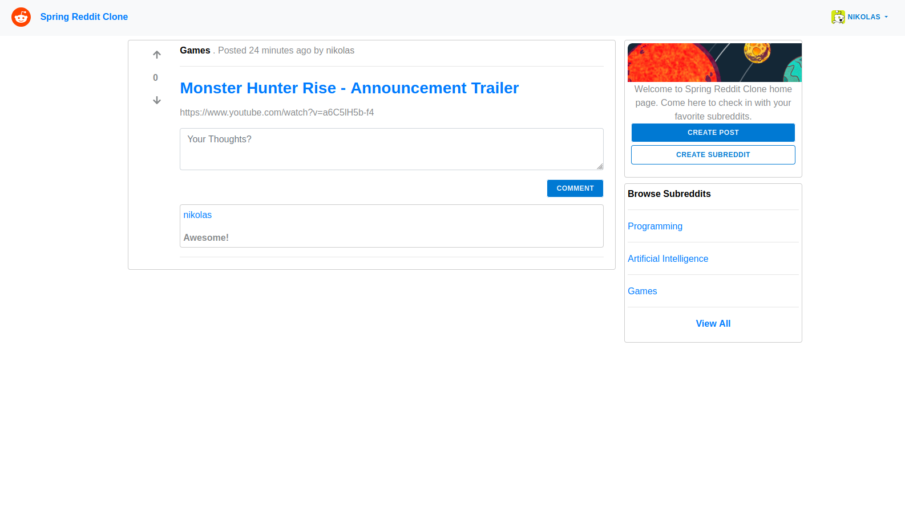
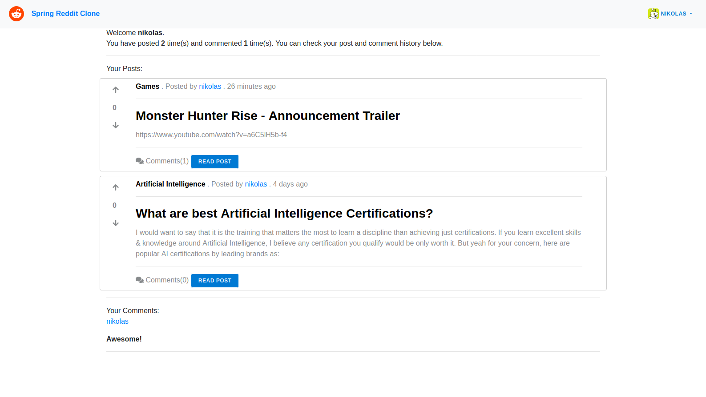

<p align="center">
   
</p>

<p align="center">	
   <a href="https://www.linkedin.com/in/nikolaslacerda/">
      
   </a>
  
  
  
  
  
  <a href="https://github.com/nikolaslacerda/reddit-clone/commits/master">
    
  </a> 
  
  
  
</p>

<p align="center">
 <a href="#computer-projeto">Projeto</a> •
    <a href="#art-layout">Layout</a> •
 <a href="#rocket-tecnologias">Tecnologias</a> •
 <a href="#construction_worker-como-executar">Como executar</a>
</p>

## :computer: Projeto

Um pequeno clone do Reddit construído usando Spring Boot, Spring Security com autenticação JWT, Spring Data JPA com PostgreSQL e Spring MVC. O frontend foi construído usando Angular. 

O projeto explora as principais funcionalidades do Reddit, como a criação de subreddits, posts, comentários e votos.

O projeto está hospedado no Heroku e pode ser acessado clicando [aqui](https://web-reddit-clone.herokuapp.com).

## :art: Layout

Home | Post
---|---
|  |  

Profile | Create Subreddit
---|---
|  |  | 

## :rocket: Tecnologias

Esse projeto foi desenvolvido com as seguintes tecnologias:

- [Java 8](https://www.java.com/en/)
- [Spring Boot 2.2](https://spring.io/projects/spring-boot)
- [Spring Security](https://spring.io/projects/spring-security)
- [Spring Data JPA](https://spring.io/projects/spring-data-jpa)
- [Hibernate](https://hibernate.org)
- [PostgreSQL](https://www.postgresql.org)
- [Maven](https://maven.apache.org)
- [Angular](https://angular.io)
- [Angular CLI](https://cli.angular.io)
- [Bootstrap](https://getbootstrap.com)

## :construction_worker: Como executar


#### :repeat: Clone o Repositório

```bash

$ git clone https://github.com/nikolaslacerda/reddit-clone.git

```

#### :package: Executando a API

```bash

# Acesse a pasta do server no terminal/cmd:

$ cd reddit-clone/reddit

# Instale as dependências:

$ mvn install

# Execute a aplicação:

$ mvn spring-boot:run

```

O servidor iniciará na porta 8080 - acesse http://localhost:8080

#### :computer: Executando a aplicação web

```bash

# Acesse a pasta web no terminal/cmd:

$ cd reddit-clone/web

# Instale as dependências:

$ npm install

# Execute a aplicação:

$ ng serve

```

A aplicação iniciará na porta 4200 - acesse http://localhost:4200
